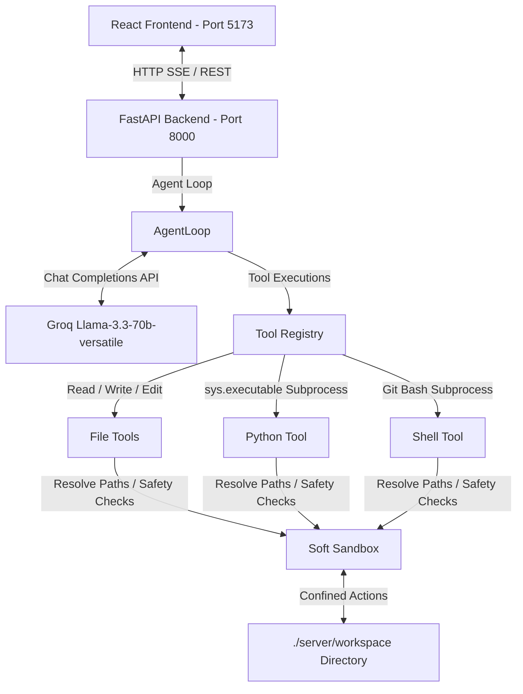

# Antigravity Code Assistant

Antigravity Code is a minimal yet powerful agentic AI coding assistant framework, similar to Claude Code. It features a complete `THINK -> ACT -> OBSERVE` tool-use loop, a soft-sandboxed workspace environment, a FastAPI backend streaming reasoning steps using Server-Sent Events (SSE), and a modern React frontend dashboard with a live workspace file explorer.

---

## Architecture & System Design



---

## Directory Structure

The project is structured with a clear separation of concerns between client and server:

```
Agent/
├── .env                  # Server environment configuration (API keys, ports)
├── pyproject.toml        # Server Python project configuration & dependencies
├── README.md             # Project documentation (this file)
├── server/
│   ├── main.py           # FastAPI entrypoint (middleware, routers)
│   ├── config.py         # Settings loaded from environment variables
│   ├── api/
│   │   └── routes.py     # SSE Chat and Workspace exploration API endpoints
│   ├── agent/
│   │   ├── loop.py       # THINK-ACT-OBSERVE generator function
│   │   ├── llm.py        # Groq client wrapper
│   │   ├── prompts.py    # Agent's system prompt instructions
│   │   └── schemas.py    # Pydantic schemas for API validation
│   ├── tools/
│   │   ├── base.py       # Tool registry and base dataclass definition
│   │   ├── sandbox.py    # Path jailing, command safety, and subprocess runner
│   │   ├── file_tools.py # CRUD operations for text files (line-numbered read, substring edit)
│   │   ├── python_tool.py# Python snippet and file execution
│   │   └── shell_tool.py # Safe shell command executor (Git Bash on Windows)
│   └── workspace/        # Sandboxed directory where agent operates
└── client/
    ├── index.html        # Main HTML layout
    ├── vite.config.js    # Vite configuration with API proxy on port 5173
    ├── package.json      # Node.js project configuration & dependencies
    └── src/
        ├── main.jsx      # React entrypoint
        ├── App.jsx       # Layout component coordinating chat and workspace
        ├── index.css     # CSS style definition (Glassmorphic dark layout)
        └── components/
            ├── ChatInterface.jsx # SSE stream processor, handles user inputs and logs
            ├── StepView.jsx      # Expandable log renderer for thoughts/tools
            └── WorkspaceViewer.jsx # Live file explorer for ./server/workspace
```

---

## Features

### 1. Soft Sandbox & Safety
Every filesystem or shell execution passes through `server/tools/sandbox.py`:
* **Path Jailing**: All file/directory paths are resolved using `resolve_path()` which throws a `SandboxViolation` if a path points outside `./server/workspace` (e.g. attempting to read `../../etc/passwd`).
* **Subprocess Timeout**: Subprocesses are spawned using `run_subprocess()` which sets a hard timeout limit (default 20 seconds).
* **Command Blocklist**: Refuses to run commands containing dangerous tokens: `rm`, `sudo`, `shutdown`, `reboot`, `mkfs`, `dd`, `chmod`, `chown`, `curl`, `wget`, `kill`, `killall`.

### 2. Streamed Agent Reasoning
* The agent loop is written as a Python generator (`loop.py`). As the agent thinks, invokes a tool, or receives tool outputs, the FastAPI endpoint `POST /api/chat` sends these events to the browser in real-time as Server-Sent Events (SSE).
* This provides instant transparency into the agent's work cycle:
  1. `thought`: The model's planning.
  2. `tool_call`: The tool the model decided to execute and its parameters.
  3. `tool_result`: The return value of the tool.
  4. `final`: The final conversational answer.

### 3. Interactive UI Dashboard
* **Chat Console**: A messaging bubble feed showing user input and agent steps. Thoughts are shown with brain icons, and tool executions are presented as expandable terminal-like cards.
* **Workspace Explorer**: A live tree browser showing the directory contents of the sandboxed `./server/workspace`. It refreshes automatically when tools execute.
* **Drawer Code Viewer**: Clicking a file in the explorer slides out a code panel that retrieves and renders the file content directly.

---

## API Documentation

### 1. SSE Chat Stream
* **URL**: `POST /api/chat`
* **Request Schema** (`ChatRequest`):
```json
{
  "message": "Create a file named fib.py that prints Fibonacci numbers up to 100",
  "history": [
    { "role": "user", "content": "Hello" },
    { "role": "assistant", "content": "Hello! How can I help you today?" }
  ]
}
```
* **Response**: `text/event-stream` returning `AgentEvent` objects of the following format:
```json
data: {"type": "thought", "data": {"text": "I will write a python script called fib.py...", "step": 0}}

data: {"type": "tool_call", "data": {"name": "write_file", "arguments": "{\"path\": \"fib.py\", \"content\": \"...\"}", "step": 0}}

data: {"type": "tool_result", "data": {"name": "write_file", "result": {"path": "fib.py", "bytes_written": 204, "status": "ok"}, "step": 0}}

data: {"type": "final", "data": {"text": "I have created the fib.py file. Let me know if you want me to run it."}}

data: {"type": "stream_end", "data": {}}
```

### 2. Get Workspace Files
* **URL**: `GET /api/workspace/files?path={relative_path}`
* **Response**:
```json
{
  "path": ".",
  "entries": [
    { "name": "fib.py", "type": "file", "size": 204, "path": "fib.py" },
    { "name": "src", "type": "dir", "size": null, "path": "src" }
  ]
}
```

### 3. Get Workspace File Content
* **URL**: `GET /api/workspace/file?path={relative_path}`
* **Response**:
```json
{
  "path": "fib.py",
  "content": "def fib(n):\n    ...",
  "size": 204
}
```

---

## Getting Started

### Prerequisites
* **Python** >= 3.11
* **Node.js** >= 18
* **uv** (fast Python package manager)
* **npm** or **yarn**

### Step 1: Clone and Set Up environment
1. Clone the repository to your system.
2. In the root directory, create a `.env` file containing your Groq API key:
   ```env
   GROQ_API_KEY=gsk_your_key_here
   GROQ_MODEL=llama-3.3-70b-versatile
   WORKSPACE_DIR=./server/workspace
   ```

### Step 2: Start the Backend Server
1. Run the FastAPI backend:
   ```bash
   uv run uvicorn server.main:app --port 8000
   ```
2. The server will start on `http://127.0.0.1:8000`. You can check the OpenAPI documentation at `http://127.0.0.1:8000/docs`.

### Step 3: Install & Start the Client Frontend
1. Navigate to the client directory:
   ```bash
   cd client
   ```
2. Install npm modules:
   ```bash
   npm install
   ```
3. Start the Vite React development server:
   ```bash
   npm run dev
   ```
4. Open your browser and navigate to `http://localhost:5173`.
